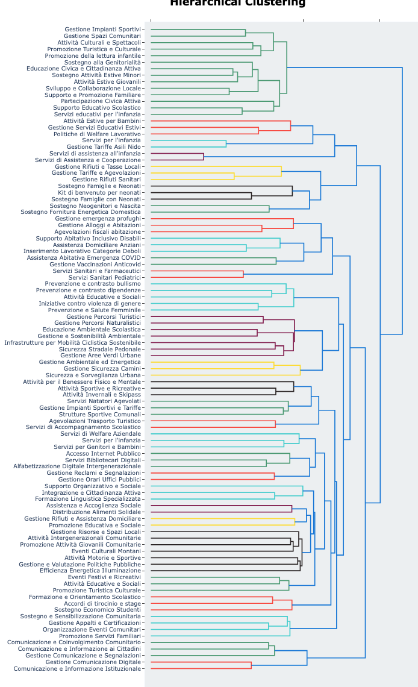

# Creazione di una tassonomia di azioni data-drive 
Repository per la creazione di una tassononmia della azioni in modo data-driven.

## Overview
A partire dal database delle azioni presentate nei piani comunali, è stato implementato un algoritmo di topic modelling basato su transformer (BERTopic – [Grootendorst, 2022](https://arxiv.org/pdf/2203.05794)) per individuare azioni descritte in modo simile e assegnarle a una tassonomia di un certo numero desiderato di categorie. Ogni titolo di ogni azione del database, e la sua descrizione, sono convertiti in un [text embedding](https://it.wikipedia.org/wiki/Word_embedding) da un modello del linguaggio. Per individuare azioni descritte in modo simile che possono fare parte di una stessa categoria, sono poi raggruppati per similarità semantica, iterativamente fino ad arrivare al numero di categorie desiderate. Ogni categoria è descritta tramite le 30 parole più rappresentative. Per ottenere una struttura multi-livello, in modo da suggerire non soltanto le categorie ma anche le macro-categorie, è stato utilizzato hierarchical topic modeling, per cui dopo aver generato le categorie viene creato un ulteriore livello della tassonomia che raggruppa le categorie in macro-categorie che raggruppano ambiti affini. Le 30 parole più rappresentative di ciascuna classe sono poi fornite ad un LLM che propone una etichetta sintetica come categoria dell’azione (passaggio opzionale). A sua volta, le categorie appartenenti ad un cluster specifico sono state passate ad un LLM che propone un nome per la macro-categoria.

## Output 1: fine-grained tassonomia 
Il dendrogarmma della tassonomia ottenuta è mostrato in figura. Nella cartella Results si può trovare la versione del dendrogramma, esplorabile dinamicamente. 
Modificando parametri quali il numero di classi richiesto, o il testo utilizzato per descrivere le azioni (per esempio utilizzando l'obiettivo dell'azione invece della descrizione), si possono creare nuove tassonomie 

  

## Output 2: tassonomia per macro-categorie
Il raggruppamento per macro cagorie ha identificato le seguenti aree. Modificando la soglia a cui si "taglia" la tassonomia, si potranno ottenere diversi livelli di granularità.

**Macro categoria 1: Servizi Comunitari e Educativi Locali:** -> sottocategorie: Gestione Impianti Sportivi, Gestione Spazi Comunitari, Attività Culturali e Spettacoli, Promozione Turistica e Culturale, Promozione della lettura infantile, Sostegno alla Genitorialità, Educazione Civica e Cittadinanza Attiva, Sostegno Attività Estive Minori, Attività Estive Giovanili, Sviluppo e Collaborazione Locale, Supporto e Promozione Familiare, Partecipazione Civica Attiva, Supporto Educativo Scolastico, Servizi educativi per l'infanzia
**Macro categoria 2: Servizi Educativi e Welfare Estivo:** Attività Estive per Bambini, Gestione Servizi Educativi Estivi, Politiche di Welfare Lavorativo  
**Macro categoria 3: Servizi e tariffe asili nido:** Servizi per l'infanzia, Gestione Tariffe Asili Nido  
**Macro categoria 4: Servizi di assistenza e cooperazione infantile:** Servizi di assistenza all'infanzia, Servizi di Assistenza e Cooperazione  
**Macro categoria 5: Gestione Rifiuti, Tariffe e Tasse:** Gestione Rifiuti e Tasse Locali, Gestione Tariffe e Agevolazioni, Gestione Rifiuti Sanitari  
**Macro categoria 6: Sostegno Famiglie e Neonati:** Sostegno Famiglie e Neonati, Kit di benvenuto per neonati, Sostegno Famiglie con Neonati  
**Macro categoria 7: Sostegno Familiare e Domestico:** Sostegno Neogenitori e Nascita, Sostegno Fornitura Energetica Domestica  
**Macro categoria 8: Gestione Alloggi e Politiche Abitative:** Gestione emergenza profughi, Gestione Alloggi e Abitazioni, Agevolazioni fiscali abitazione  
**Macro categoria 9: Servizi Assistenza e Inclusione Sociale:** Supporto Abitativo Inclusivo Disabili, Assistenza Domiciliare Anziani, Inserimento Lavorativo Categorie Deboli  
**Macro categoria 10: Gestione Emergenza COVID e Vaccini:** Assistenza Abitativa Emergenza COVID, Gestione Vaccinazioni Anticovid  
**Macro categoria 11: Servizi Sanitari e Pediatrici:** Servizi Sanitari e Farmaceutici, Servizi Sanitari Pediatrici  
**Macro categoria 12: Prevenzione, Educazione e Salute Sociale:** Prevenzione e contrasto bullismo, Prevenzione e contrasto dipendenze, Attività Educative e Sociali, Iniziative contro violenza di genere, Prevenzione e Salute Femminile  
**Macro categoria 13: Gestione Sostenibile Aree e Mobilità:** Gestione Percorsi Turistici, Gestione Percorsi Naturalistici, Educazione Ambientale Scolastica, Gestione e Sostenibilità Ambientale, Infrastrutture per Mobilità Ciclistica Sostenibile, Sicurezza Stradale Pedonale, Gestione Aree Verdi Urbane  
**Macro categoria 14: Gestione Sicurezza Ambientale ed Urbana:** Gestione Ambientale ed Energetica, Gestione Sicurezza Camini, Sicurezza e Sorveglianza Urbana  
**Macro categoria 15: Attività Sportive e Benessere Invernale:** Attività per il Benessere Fisico e Mentale, Attività Sportive e Ricreative, Attività Invernali e Skipass  
**Macro categoria 16: Gestione Strutture Sportive Comunali:** Servizi Natatori Agevolati, Gestione Impianti Sportivi e Tariffe, Strutture Sportive Comunali  
**Macro categoria 17: Servizi Trasporto e Accompagnamento:** Agevolazioni Trasporto Turistico, Servizi di Accompagnamento Scolastico  
**Macro categoria 18: Servizi Welfare e Infanzia Familiare:** Servizi di Welfare Aziendale, Servizi per l'infanzia, Servizi per Genitori e Bambini  
**Macro categoria 19: Servizi Digitali e Alfabetizzazione Pubblica:** Accesso Internet Pubblico, Servizi Bibliotecari Digitali, Alfabetizzazione Digitale Intergenerazionale  
**Macro categoria 20: Gestione Servizi Pubblici e Reclami:** Gestione Reclami e Segnalazioni, Gestione Orari Uffici Pubblici  
**Macro categoria 21: Integrazione, Supporto, Formazione, Cittadinanza, Comunità:** Supporto Organizzativo e Sociale, Integrazione e Cittadinanza Attiva, Formazione Linguistica Specializzata  
**Macro categoria 22: Assistenza Sociale e Distribuzione Alimenti:** Assistenza e Accoglienza Sociale, Distribuzione Alimenti Solidale  
**Macro categoria 23: Gestione Rifiuti, Assistenza, Educazione, Promozione Sociale:** Gestione Rifiuti e Assistenza Domiciliare, Promozione Educativa e Sociale  
**Macro categoria 24: Sviluppo Comunitario e Gestione Locale:** Gestione Risorse e Spazi Locali, Attività Intergenerazionali Comunitarie, Promozione Attività Giovanili Comunitarie, Eventi Culturali Montani, Attività Motorie e Sportive, Gestione e Valutazione Politiche Pubbliche, Efficienza Energetica Illuminazione  
**Macro categoria 25: Eventi Culturali e Attività Sociali:** Eventi Festivi e Ricreativi, Attività Educative e Sociali, Promozione Turistica Culturale  
**Macro categoria 26: Supporto e Opportunità per Studenti:** Formazione e Orientamento Scolastico, Accordi di tirocinio e stage, Sostegno Economico Studenti  
**Macro categoria 27: Sviluppo e Supporto Comunitario:** Sostegno e Sensibilizzazione Comunitaria, Gestione Appalti e Certificazioni, Organizzazione Eventi Comunitari, Promozione Servizi Familiari  
**Macro categoria 28: Comunicazione, Coinvolgimento e Informazione Comunitaria:** Comunicazione e Coinvolgimento Comunitario, Comunicazione e Informazione ai Cittadini, Gestione Comunicazione e Segnalazioni  
**Macro categoria 29: Gestione Comunicazione Digitale Istituzionale:** Gestione Comunicazione Digitale, Comunicazione e Informazione Istituzionale

## Contenuti della repository

1. `model_generation.ipynb` : notebook per generare il modello di topic-modeling 
2. `taxonomy_visualization.ipynb` : notebook che carica il modello genearto in 1. e genera varie visualizzazioni
3. `LLM_label_generation.ipynb` : notebook che genera etichette in linguaggio naturale a partire dalle 30 parole più rappresentative di ogni categoria
4. `second_level_taxonomy` : notebook che genera etichette  per ogni cluster di categorie della tassonomia 
5.  cartella `Results` 
  - 4.1 sottocartella `model` in questa cartella è salvato il modello generato in 1. (e utilizzati dallo script `taxonomy_visualization.ipynb`)
  - 4.2 `topics_overview.tsv` per ogni topic è descritto il label assegnato automaticamente dall'algoritmo, le 30 parole più rappresentative, il label assegnato dall'LLM
  - 4.4 `Dendrogram_taxonomy.html` , `Dendrogram_taxonomy_reanmed.html` , `Dendrogram_taxonomy_reduced.html` Dendrogramma delle categorie, dendrogramma delle categorie rinominate, dendrogramma delle categorie di alto livello
    
